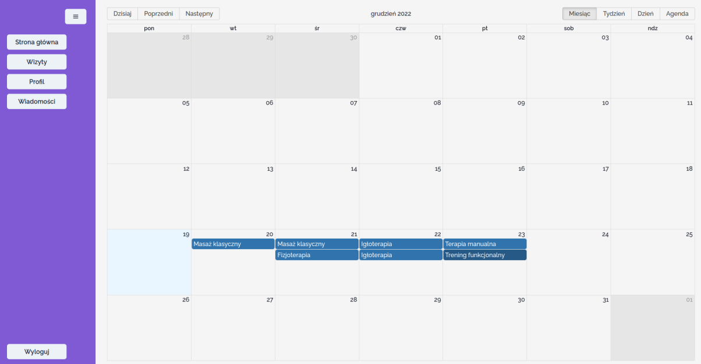
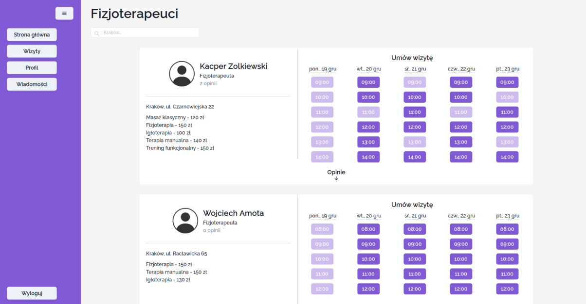
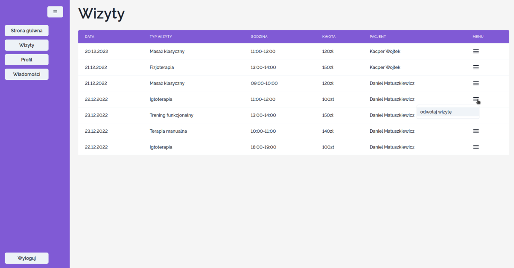
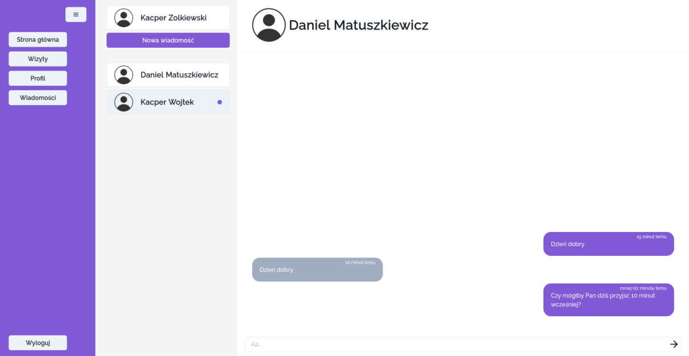

# 🏥 Physiotherapist-Patient Portal

This project is a web application designed to connect physiotherapists with their patients. The platform allows physiotherapists to manage their availability, interact with patients, and handle appointment bookings. Patients can reserve appointments, leave reviews, and communicate with physiotherapists. 

## 🛠️ Tech Stack

- **TypeScript**: Ensures strong typing and better developer experience.
- **React.js**: For building the interactive frontend interface.
- **Next.js**: Framework used for server-side rendering and optimized performance.
- **Chakra UI**: For fast and customizable component-based design.
- **GraphQL**: Used for querying the database.
- **Nhost**: Backend platform to manage the PostgreSQL database, with access to Hasura's console for testing and managing GraphQL queries.
- **ESLint**: Linter to maintain code quality and consistency.
- **Prettier**: Code formatter for clean and readable code.
- **Cypress**: End-to-end testing framework to ensure the application works as intended.
- **Yup**: Schema-based form validation used with **react-hook-form**.

---

## 📱 Features & How It Works

### For Physiotherapists:
- 👥 **Manage Calendar**: Add availability for patients to book appointments.
- 💬 **Patient Messaging**: Communicate with patients directly through the app's built-in messaging system.
- 📅 **Appointment Management**: View upcoming appointments.

### For Patients:
- 📅 **Book Appointments**: Reserve a specific type of appointment with a physiotherapist based on their availability.
- ⭐ **Leave Reviews**: Provide feedback for the physiotherapist after completing an appointment.
- 💬 **Messaging**: Communicate directly with physiotherapists for follow-up discussions or queries.

---

### Backend Setup (Nhost & GraphQL)

The application leverages the **Nhost** platform, which provides a **GraphQL API** for fetching and inserting data into the **PostgreSQL** database. Additionally, it offers access to the **Hasura Console**, making it easier to test and manage GraphQL queries.

### Frontend-Backend Communication

Communication between the frontend and the database is facilitated through **auto-generated hooks** based on GraphQL queries. These hooks are generated using **GraphQL Code Generator** and stored in the `api/graphql.ts` file, allowing seamless integration between frontend components and the database.

### Form Validation

For form validation, **Yup** is integrated with **React Hook Form** to ensure robust form validation. This combination ensures that the input data is validated and clean before submission, improving the overall data integrity and user experience.

## 📸 Screenshots

1. **Physiotherapist's Main Page (Calendar & Appointments)**  
   _View and manage upcoming appointments on a weekly calendar._
   
   

2. **Patient's Main Page (Search Physiotherapists)**  
   _Search for physiotherapists based on name._
   
   

3. **Patient Visits Page**  
   _View past and upcoming visits with physiotherapists, manage appointments._
   
   

4. **Physiotherapist Messaging Page**  
   _Communicate directly with patients._
   
   

## 🧪 Testing

The application is tested using **Cypress**, an end-to-end testing framework. Cypress simulates user behavior and ensures that the application functions correctly from the perspective of both physiotherapists and patients.

## 💬 Contact

If you have any questions or want to discuss my project, feel free to reach out!

- **Email**: kacperzolkiewski@gmail.com
- **LinkedIn**: [Kacper Żółkiewski](https://www.linkedin.com/in/kzolkiewski/)
